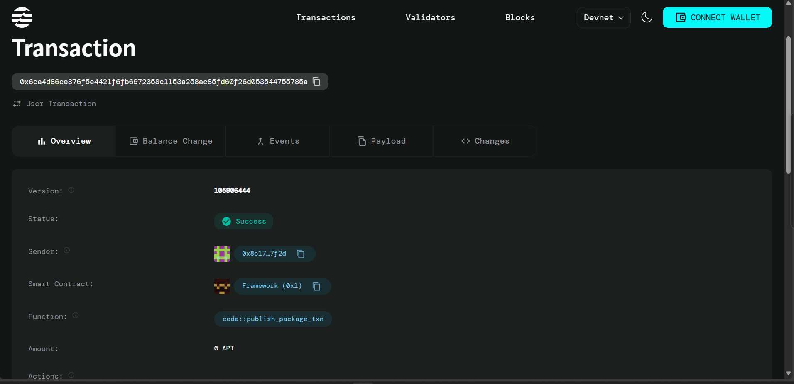

# Fraud Detection System on Aptos

## Project Title  
Aptos FraudDetection - A Decentralized Fraud Monitoring Smart Contract

## Project Description  
FraudDetection is a lightweight, secure, and transparent fraud reporting system built on the Aptos blockchain. This smart contract allows users to report suspicious transactions or addresses in a decentralized manner. The system is designed with simplicity and accountability in mind, preventing duplicate reports and maintaining immutable records of all fraud reporting activities.

The contract includes essential functionality:  
- Fraud report creation for addresses or transactions  
- Secure verification mechanism for submitted reports  
- Protection against duplicate reporting  
- Immutable record logging of reports

## Project Vision  
The vision behind FraudDetection is to democratize fraud prevention by leveraging blockchain technology. By providing a transparent, tamper-proof fraud reporting system, we aim to enable communities, organizations, and DAOs to collaboratively track and prevent malicious activities without relying on centralized authorities. Our goal is to make fraud monitoring accessible, decentralized, and effective.

FraudDetection represents the first step toward a comprehensive suite of security and monitoring tools that can empower decentralized communities to maintain trust and transparency.

## Future Scope  
The current implementation provides foundational features for decentralized fraud reporting, but several enhancements are planned for future versions:

1. **Report Validation Layer**: Allow verified members to approve/reject submitted fraud reports.  
2. **Reputation System**: Track the credibility of reporters based on past valid/invalid reports.  
3. **Automated Alerts**: Notify concerned entities when a report is filed against them.  
4. **IPFS Integration**: Store supporting evidence like screenshots or logs using decentralized storage.  
5. **Report Categorization**: Classify reports based on severity, type, and verification status.  
6. **Analytics Dashboard**: Provide fraud trends and metrics visualization via frontend UI.  
7. **API for DApp Integration**: Enable external platforms to access and submit reports via API.  
8. **Incentivization Model**: Reward users with tokens for valid fraud detection reports.

## Contract Details  
- **Module Address**: `0x8c176b636fde8dcdff17583c30ce4086e7629c67be742b1009b8d98ff54e7f2d`  
- **Transaction Hash**: `0x6ca4d86ce876f5e4421f6fb6972358c1153a258ac85fd60f26d053544755785a`  
- **Module Name**: `FraudDetection`  

## Transaction Example

Here is an example of a successful contract interaction:

### Key Functions:
- `report_fraud`: Submits a new fraud report  
- `verify_report`: Confirms the validity of a fraud report  

### Error Codes:
- `E_ALREADY_REPORTED (1)`: This address/transaction has already been reported  
- `E_UNAUTHORIZED (2)`: User is not authorized to verify reports

---

To interact with this contract, you'll need an Aptos wallet and some APT tokens for transaction fees. You can call the contract functions through the Aptos CLI or by building a frontend application that interfaces with the Aptos blockchain.
